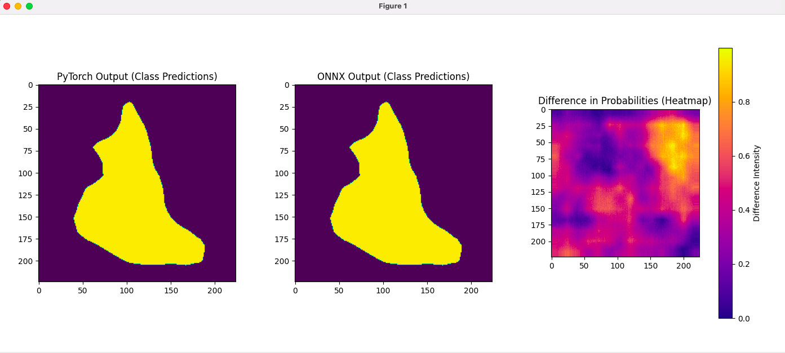
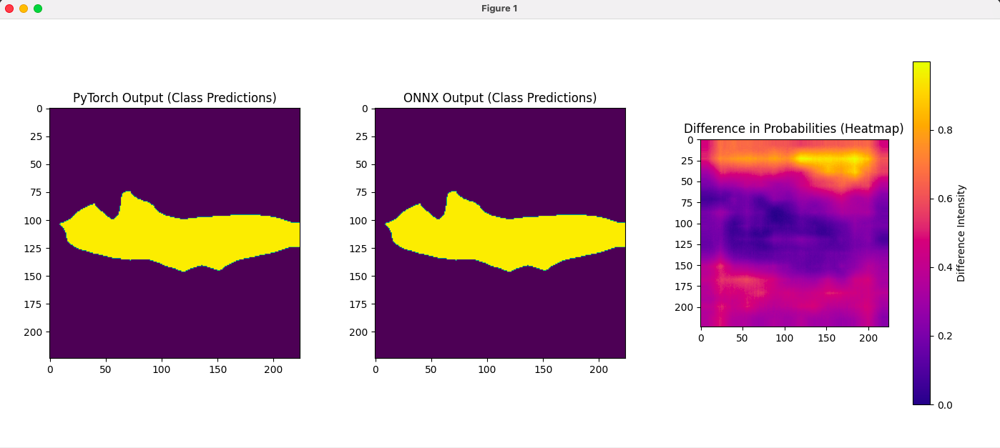

# Segmentation Model Project

This project is designed for model conversion, preprocessing, and segmentation using various machine learning tools. It is structured into three phases:

- **Phase 1**: Model conversion from PyTorch to ONNX format.
- **Phase 2**: Contains utility functions and classes for segmentation models but does not require standalone execution.
- **Phase 3**: API-based inference and client interactions.

## **NOTE** This project runs properly on python version 3.10.
### (I have used this python version since one of the packages I have used is require that python version. I assume i could use a different package but due to time constraints I chose that package.)

## Table of Contents
1. [Project Overview](#project-overview)
2. [Setup Instructions](#setup-instructions)
3. [Build and Run Using Docker](#build-and-run-using-docker)
4. [Phase Instructions](#phase-instructions)
   - [Phase 1 - Convert.py](#phase-1---convertpy)
   - [Phase 2 - Utilities](#phase-2---utilities)
   - [Phase 3 - API and Client](#phase-3---api-and-client)
5. [Requirements](#requirements)

## Project Overview

This project provides tools for converting a PyTorch model to ONNX format, running inferences using the converted model, and serving predictions through an API. The folder structure is organized as follows:

- **Phase 1**: Contains `convert.py` for model conversion.
- **Phase 2**: Contains utility modules for segmentation model processing.
- **Phase 3**: Contains `api.py` for serving model predictions via an API and `client.py` for interacting with the API.
- **model utils**: Contains functions used in few phases.

## Setup Instructions

1. **Clone the repository**:

```bash
git clone https://github.com/idoziv15/SegmentationModelProject.git
cd SegmentationModelProject
```

2. **Create a virtual environment (optional but recommended)**:

On Linux/MacOS:
```
python3 -m venv venv
source venv/bin/activate
```

On Windows:
```
python3 -m venv venv
venv\Scripts\activate
```

3. **Install dependencies:**
```
pip install -r requirements.txt
```

## Phase Instructions
### Phase 1 - Convert.py
The convert.py script converts a PyTorch model to ONNX format and runs inferences on both PyTorch and ONNX models to validate the conversion.

Usage:
```
python phase_1/convert.py --model_name <model_name> --image_path <path_to_image>

Or

cd phase_1
python convert.py --model_name <model_name> --image_path <path_to_image>
```
model_name (Optional): The name of the PyTorch model to convert (default: "deeplabv3_mobilenet_v3_large").

image_path (Optional): Path to the input image (default: "cat2.jpg").

### Phase 2 - Utilities
Phase 2 provides utility functions and classes for segmentation processing. This phase does not contain any standalone scripts to run directly.

### Phase 3 - API and Client
Phase 3 contains two main scripts: api.py and client.py. You will need to first run the API (api.py) and then you will be able to run client.py.

#### Running api.py:
The api.py script serves model predictions through an API endpoint. It requires model and image input as arguments.
The API will run by default on localhost:8000.
You should see at http://127.0.0.1:8000/docs a FastAPI swagger interface, to make sure the API is properly running.

Usage:
```
uvicorn phase_3.api:app --reload

Or

cd phase_3
uvicorn api:app --reload

```

#### Running client.py:
The client.py script interacts with the API, sending requests for model inference. Make sure api.py is running on the specified host and port before executing client.py.

Usage:
```
python phase_3/client.py --model_name <model_name> --image_path <path_to_image> --use_onnx

Or

cd phase_3
python client.py --model_name <model_name> --image_path <path_to_image> --use_onnx
```

## Running with Docker (Alternative)
## Build and Run Using Docker

This project can be easily built and run using Docker. Follow the steps below to get started.

### Prerequisites

- Ensure you have Docker installed on your machine. You can download it from [Docker's official website](https://www.docker.com/get-started).
- Make sure you have `make` installed. It is usually available on Unix-based systems by default. For Windows, you can use tools like [Cygwin](https://www.cygwin.com/) or [WSL](https://docs.microsoft.com/en-us/windows/wsl/install).

### Building the Docker Image

1. Open a terminal and navigate to the root directory of the project.
2. Run the following command to build the Docker image:

   ```bash
   make build
   ```

   This command will create a Docker image named `segmentation-model`.

### Running the Docker Container

You can run the Docker container using one of the following methods:

#### Default Run

To run the container with default settings, execute:

```bash
make run
```

This will start the container and expose the API at `http://localhost:8000/docs`.

#### Custom Run

To run the container with custom model and image settings, use:

```bash
make run-custom MODEL=model_name IMAGE=path/to/image USE_ONNX=True
```

Replace `model_name`, `path/to/image`, and `USE_ONNX` with your desired values.

#### Run with Mounted Volumes

If you want to mount local directories for models and images, use:

```bash
make run-mounted
```

This will allow you to persist models and images between container runs.

### Stopping the Container

To stop and remove the running container, use:

```bash
make stop
```

### Viewing Logs

To view the logs of the running container, execute:

```bash
make logs
```

### Accessing the API

Once the container is running, you can access the FastAPI documentation and endpoints at:

- [http://localhost:8000/docs](http://localhost:8000/docs)

### Cleaning Up

To stop the container and remove the Docker image, run:

```bash
make clean
```

This will ensure that all resources are cleaned up.

Replace <model_name> (Optional) and <path_to_image> (Optional) with appropriate values of your own, if desired.





## Requirements

Make sure to have the following Python packages installed:

- fastapi
- uvicorn
- pillow
- numpy
- onnx
- torch
- torchvision
- pydantic
- requests